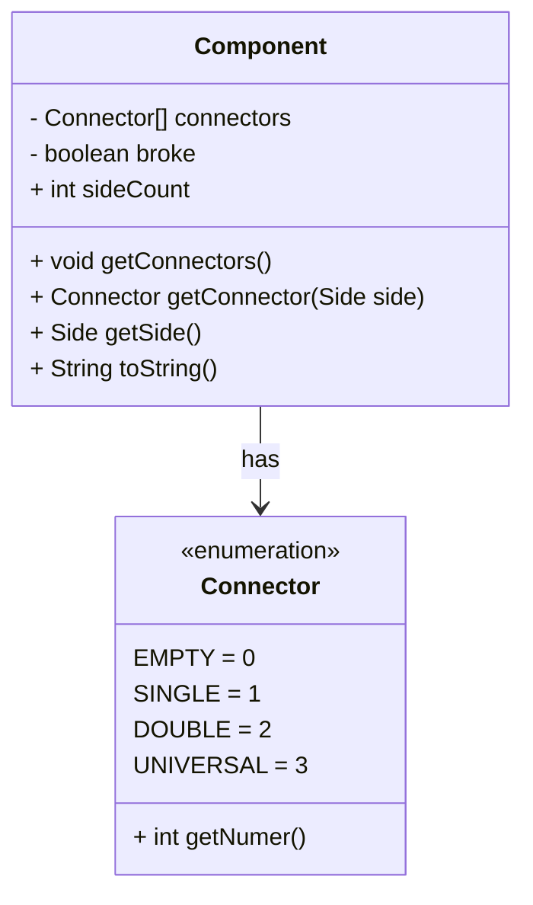

# Trattore-Galattico-G14

Si lo sappiamo trattore non è la traduzione ma fa molto ridere.
👀 Riferimenti a persone o oggetti è puramente casuale.

##Diagramma UML:
https://www.canva.com/design/DAGjUwBwZ4E/H_tNvG6d3k0TZOK19gYlTQ/edit?utm_content=DAGjUwBwZ4E&utm_campaign=designshare&utm_medium=link2&utm_source=sharebutton

